# Budget-Planner-PP3

An easy to use Budget Planner that can be run in a browser using an interactive terminal or from the CLI. A user can run a variety of commands that enable the setting of monthly goals, entering transactions and more. Its a striaghtforward application that is suitable for anyone looking to get on top of their spending habits.

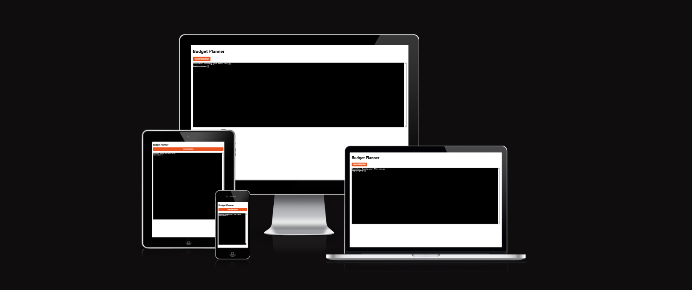
Credit: [am i responsive](https://ui.dev/amiresponsive?url=https://budget-planner-p3-2560f12ec44b.herokuapp.com/terminal.html)

View the live website here: [The Budget Planner](https://budget-planner-p3-2560f12ec44b.herokuapp.com/terminal.html)

## Table of Contents

- [Project Aims](#project-aims)
- [User Goals](#user-goals)
- [Site Owner Goals](#site-owner-goals)
- [User Experience](#user-experience-ux)
  - [Target Audience](#target-audience)
  - [User Requirements & Expectations](#user-requirements--expectations)
  - [User Stories](#user-stories)
- [Design](#design)
- [Features](#features)
  - [App Flow Logic](#app-flow-logic)
  - [Future Ideas / Potential Implementations](#future-ideas--potential-implementations)
- [Technologies Used](#technologies-used)
  - [Languages Used](#languages-used)
  - [Libraries & Programmes Used](#libraries--programmes-used)
- [Testing](#testing)
  - [Automated Testing](#automated-testing)
  - [Manual Testing](#manual-testing)
     - [User Stories](#user-stories)
  - [Bugs](#bugs)
- [Deployment](#deployment)
  - [Heroku Deployment](#heroku-deployment)
  - [How to Fork](#how-to-fork)
  - [How to Clone](#how-to-clone)
- [Credits](#credits)
  - [Content Credits](#content-credits)
  - [Acknowledgements](#acknowledgements)

## Project Aims 
The goal of this project is to create a simple Budget Planner that helps users manage their money by tracking spending and setting monthly goals. The app allows users to sign up, log in, and securely save their data using Google Sheets. Once logged in, users can add transactions, view spending summaries, and set budget goals for different categories.
The budget planner then compares what has been spent against each goal and shows if the user is over or under budget. It runs in on Heroku (an interactive web terminal), so users can access all features easily from a browser without installing anything. The main aim is to make budgeting straigt forward and accessible for everyone.

## User Goals
The overall goal here is for users to have an easy way to manage their money and track spending. Users want to be able to record transactions, set monthly budgets, and see how their spending compares to their goals. They should be able to create an account, log in safely, and view only their own data. The app helps users stay organised and understand where their money is going.

## Site Owner Goals
As site owner the overall goal is to provide a straightforward and easy to use tool that helps people manage their budgets. I want to make sure the app runs correctly and keeps data safe.

## User Experience
The budget planner is designed to be easy to follow and understand. When users open the web terminal, they are guided through simple prompts such as signing up, logging in, and adding transactions. The system gives clear feedback and colour-coded results. So users always know if they are over or under budget. It also works well on both desktop and mobile devices to give a smooth experience wherever its used.

### Target Audience 
The Budget Planner is suitable for students, professionals, or families who need a to plan n easy way to plan budgets. The app is also useful for anyone new to budgeting who prefers a clear and friendly system without over complicated financial features.

### User Requirements & Exepectations
Users expect the application to be easy to use and informative. They should be able to sign up, log in, and manage their own budgets easily without seeing other users data. All inputs should be clear, with messages tp help if something goes wrong. Users also expect that reports and summaries will show correct information about their spending  habits and goals.

### User Stories 
User stories were created to get a better understanding of what a typical user would feel while using a typical budget planner. 
We look at user stories more in testing further brlow. 

| **Title**                   | **User Story**                                                                                                            |
| --------------------------- | ------------------------------------------------------------------------------------------------------------------------- |
| **Sign Up / Log In**        | I want to be able to create an account and log in securely knowing my data is safe |
| **Add Transactions**        | I want to easily input new spending habits or income with so that I can track where my money goes. |
| **View Transactions**       | I want to see a clear list of my past transactions so I can review all my spending history.                                   |
| **Set Budget Goals**        | I want to set monthly goals for each category so I can plan how much I want to spend.                            |
| **Compare Goals and Spend** | I want to see how my spending compares to my goals so I can understand if I am over or under budget.                           |
| **Simple Commands**         | I want to use short and easy commands in the terminal so I can manage my budget without confusion.                        |
| **Stay Logged In**          | I Dont want to have to keep logging in after each input.                                |
| **Logout Option**           | I want to be able to log out when I finish, so I know my account is secure.    | 

## Design 
Seen as the application runs entirely in the terminal, the layout was primarily designed to be easy to navigate. Headings and sections are clearly spaced to improve readability and important parts of the output use colour highlighting for better visuals. Green text is used for success messages or being under budget, while red text indicates errors or overspending. 

## Features
The features section below explains all the features available for the budget planner application. Its important to note that while the "editor" or site owner has all the features available that a regular user does. The editor also has additional functionality that is not available to a regular user and for good reason. 

The budget planner application has been designed to allow for different permissions. This was an important feature as to ensure any "editors" or site owner could make changes on behalf of regular application users if needed. For example a user that was locked out or for whatever reason didnt have access at the time to important information. The editor can act on behalf of the user if requested to maybe add transactions or withdrraw current budget status information. 

Importanlty a regular user does not have any access to other users information and cannot act on their behalf.

### All Users
The features available to all regular users can be seen in the below table. A user firslty signs up or logs in, once succesfully logged in a user can select from any of the below commands. All command options are also listed with descriptions and examples after login.

| Command | What it does | Key options | Example |
|---|---|---|---|
| `signup` | Create an account | - | `bp> signup` |
| `login` | Sign in (sets session) | - | `bp> login` |
| `change-password` | Change your password | `--current`, `--new`, `--confirm` | `bp> change-password` |
| `logout` | Sign out (clears session) | - | `bp> logout` |
| `add-txn` | Add a transaction | `--date YYYY-MM-DD`, `--category`, `--amount`, `--note` | `bp> add-txn` |
| `list-txns` | Show recent transactions | `--date YYYY-MM-DD`, `--limit` | `bp> list-txns --limit 20` |
| `sum-month` | Show monthly total | `--month YYYY-MM` | `bp> sum-month --month 2025-10` |
| `summary` | Totals by category | `--date YYYY-MM-DD` (optional) | `bp> summary` |
| `set-goal` | Set a monthly goal | `--month YYYY-MM`, `--category`, `--amount` | `bp> set-goal --month 2025-10 --category groceries --amount 50` |
| `list-goals` | Show your goals | `--month YYYY-MM` (optional) | `bp> list-goals --month 2025-10` |
| `budget-status` | Compare goals vs spend (diff color-coded) | `--month YYYY-MM` | `bp> budget-status --month 2025-10` |
| `whoami` | Show your account info | - | `bp> whoami` |
| `exit` | exit (ends session) | - | `bp> exit` |
| `menu` | Show menu/instructions | - | `bp> menu` |

#### Login 
Please see the below images relating to login. A user types "login" followed by being asked to enter an email address. Then a password is requested, after this a message is shown to confirm you have logged in successfully or unsuccesfully. Please note password field looks empty due to password hash feature, this is done to protect user entrys. 

| Before entering details | After successful login | Unsuccessful login attempt |
|---|---|---|
| 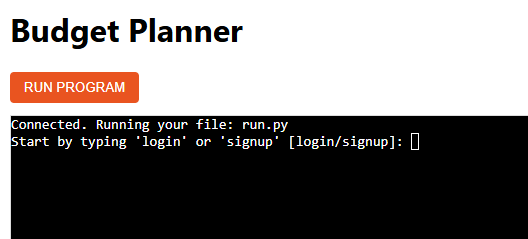 | 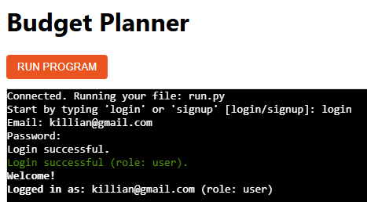 | 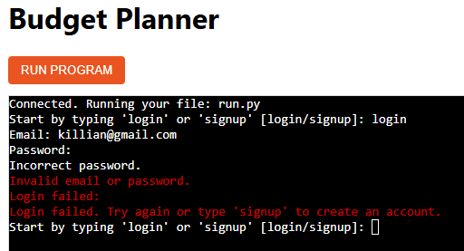 |

#### Signup
Please see the below images relating to signup. A user types "signup" followed by being asked to enter an email address. Then a password is requested to be entered twice to ensure accuracy. After this a message is shown to confirm you have logged in successfully or unsuccesfully. You are then required to login to start using the budget planner.

| Before entering details | After successful singup | Unsuccessful signup attempt |
|---|---|---|
|  | 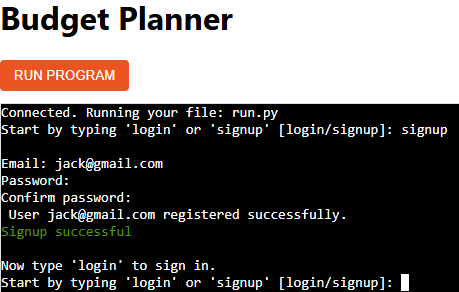 | 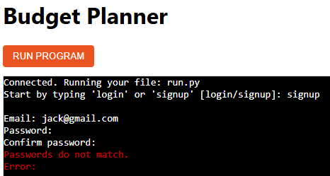 |

#### Change Password/logout
In the first image below the change password feature can be seen. This again is hashed as to protect the users new password. A user is required to be firslty logged in before aattempting to change password. The logout feature can be seen in the image on the right, this allows the user to log out form the session after the user has completed any tasks. 

| Change Password | Logout Feature | 
|---|---|
| 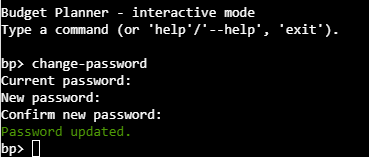 | 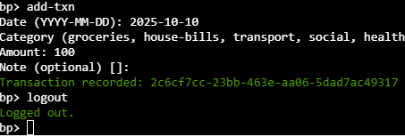 | 

#### Add transactions/List transactions
A user can add transactions by typing "add-txn" into the terminal. They are then asked to enter the date the transaction took place followed by entering a category. The amount is then entered followed by an optional note entry. A message the appears notifying the user the transaction has been recorded. (Meaning the transaction has succesfully been sent to our transactions google sheet). If a user wishes to see all of their transactions they simply type "list-txns", this provides a list of all their entered transacations (stored on the transactions google sheet) accompanied by dates, categories and notes if entered. (Can be filtered by user for editors)

| Add transactions | List transactions | 
|---|---|
| 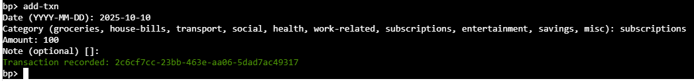 | 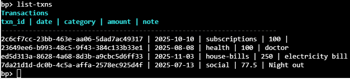 | 

#### Sum Month/Summary
A user can enter "sum-month" to see total spending for a specific month as seen in the first image below. A user can also type "summary" this option provides total spending by category as seen below. 

| Sum Month | Summary | 
|---|---|
| 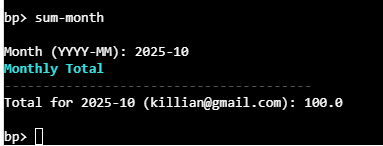 |  | 

#### Set Goal/List Goal
Users can set goals by typing "set-goal". This feature allows users to esentially set their budget allowance per month and category, then selecting the amount they do not wish to exceed. "list-goals" then allows for all goals to be viewed as per the below image.

| Set Goal | List Goal | 
|---|---|
| 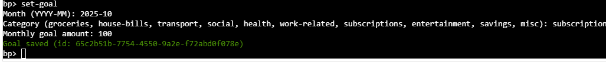 | 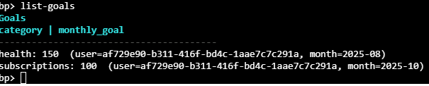 | 

#### Budget Status
This feature is a continuation from the set/list goals feature. This shows each category of budget with the goal and actual spend. As well as the difference to show if the user is acheving the set goal or falling short. Postive numbers are green and negative numbers appear in red to highlight this.

| Budget Status | 
|---|
| 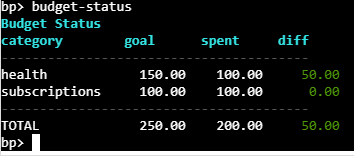 |

#### Whoami/Exit/Menu
The whoami feature allows users to double check what account they are logged into. Shows email user ID and the date the account was created.
The exit feature allows users to exit the terminal (Without a log back in option). The menu feature allows for users to type "menu" if they are confused about any of the features and how to run them. 

| whoami feature | exit feature | menu feature |
|---|---|---|
| 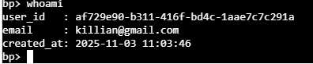 | 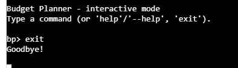 | 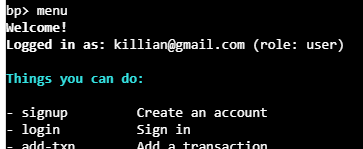 |

### Editor Only
An editor has all the regular features at their disposal for personal details if they so wish. However, there are some additional capabilites/features for editors as seen in the below table. Editors can carry out tasks and retract information on the behalf of regular users if needed. Editors can also select roles (this is not optional for regular users). Once signed in the "user" or "editor" role is assigned to ensure what can and cannot be accessed. 

| Capability | Command/How | Example |
|---|---|---|
| Act on another users data | Pass `--email` to self-scoped commands | `list-txns --email user@example.com`; `list-goals --email user@example.com --month 2025-10`; `sum-month --email user@example.com --month 2025-10`; `summary --email user@example.com`; `budget-status --email user@example.com --month 2025-10`; `whoami --email user@example.com` |
| Manage roles | `set-role --email <user> --role editor\|user` | `set-role --email user@example.com --role editor` |
| List users | `list-users [--limit N]` | `list-users --limit 10` |

#### Manage Roles/List Users (Editor only)
An editor can change the permisions on any user from "user" to "editor" if they wish. All users are regular "users" by default. As seen in the image below the editor simply types  "set-role" for the option to change a users role to appear. the list users function can be seen in the other image below. This function again is strictly only for editors. Regular users do not have permisions to view this information. 

#### Act on another users data (Editors only - example)
As seen in the image below and editor can access other users data or add a transaction if needed. This is a feature that was added in the case of emergency for any user that they could reach out to an editor for important information. The below example shows how an editor would view another users transaction.

| Manage Roles | List Users | List users transactions |
|---|---|---|
| 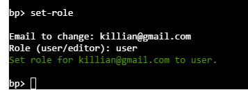 | 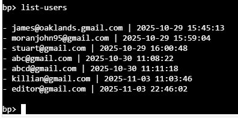 | 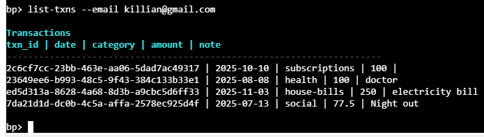 |

#### Different menu view (editiors vs user)
Another imporant feature is the different menus available depending on whos logged in. AN editor has more functionality then a standard user and so the menu is more descriptive with more options. Its also important that any commands specific to an editor are not listed for users to see, as to avoid confusion.

| Editor menu | User Menu | 
|---|---|
| 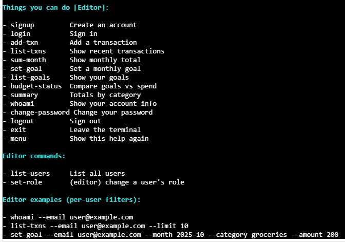 | 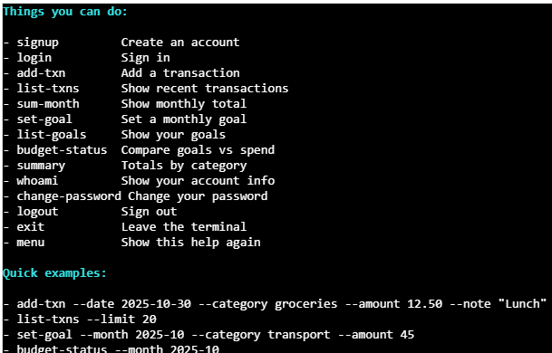 |

### Additional Features
Some additional features of how the budget planner application behaves behind the scenes can be seen below.

- Roles are in the `Role` sheet (`email`, `role`). Missing entries default to `user`. This is an important feature as to differentiate between permissions.
- Session variables (web terminal): `BP_EMAIL` (logged-in user), `BP_ROLE` (editor/user).
- Headings and separators are styled for readability. Key figures/information are also highlighted for the same reason.
- Added Terminal features for UX: `help` and `help <command>`, typos suggest Did you mean, `Ctrl+C` cancels prompts; after login.
- Commands use the session email by default as this is better practice then a user having to constantly confirm who they are.

### App flow logic 
The below diagram shows how the app works from start to finish. You open the budget planner and either sign up or log in. After a successful login, the app retains the user information so you dont need to enter your email again. From there you can choose commands like adding a transaction, listing transactions, setting or listing goals, checking budget status (with psotive/negative differences), viewing a summary, or changing your password. 
You can also show the menu, log out to end your session, or exit to close the terminal. If you are an editor, you also get extra options like listing users and setting roles, and you can act on another users data when needed.

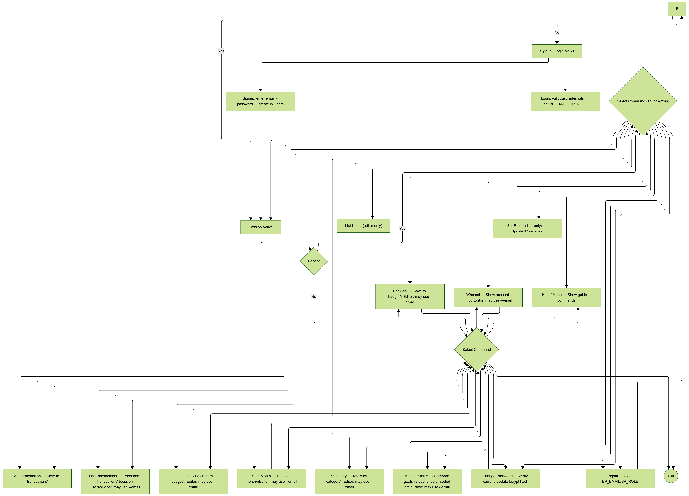

### Future Ideas / Potential Implementations
There are many growth possibilites for the budget planner in the future. Below I have listed some of the main ideas that could be implemented going forward to really take it up a level and improve the overall offering to the users. 

| Future idea | Comments |
|---|---|
| Password reset with email confirmation | Let users request a reset, send a code or link to their email, verify it, then allow a new password. |
| CSV downloads | Let users download transactions, goals and summaries as CSV (for a month or all time). Good for backups or sharing. |
| Charts and trends | Show simple graphs of spend versus goals by month so progress is easy to see. |
| Recurring transactions | Let users mark bills or subscriptions as recurring so they auto-add each month. |
| Alerts/notifications | Optional alerts when a category is close to or over its goal, or when a large transaction is added. |
| Two-factor login  | Add an extra step during login (code from email/app) for more security. |

## Technologies Used
**Python 3.12** — main programming language used to build all application logic and command-line functionality.

**Google Sheets API** — used as the external database to store users, transactions, and budget goals securely online.

**Heroku** — platform used to deploy and host the live web terminal version of the project.

**Node.js / Express.js** — used to create the web-based terminal interface that connects to the Python backend.

**Git & GitHub** — version control and repository hosting for tracking changes and project history.

**VS Code** — integrated development environment used for writing and testing code.

### Languages Used
- **Python** - core application logic and CLI.

- **JavaScript** - web terminal frontend and WebSocket bridge.

- **HTML** - structure for the terminal page.

- **CSS** - styles for the terminal page.

### Libraries & Programmes Used
- [Typer](https://typer.tiangolo.com/) - library for creating easy-to-use CLI commands.
- [bcrypt](https://pypi.org/project/bcrypt/) - securely hashes and verifies passwords.
- [gspread](https://docs.gspread.org/) - connects to Google Sheets (project database).
- [google-auth](https://googleapis.github.io/google-auth-library-python/latest/) / [oauthlib](https://oauthlib.readthedocs.io/) - authorizes secure access to the Google Sheets API.
- [pandas](https://pandas.pydata.org/) - data manipulation and calculations for reports.
- [python-dotenv](https://pypi.org/project/python-dotenv/) - loads environment variables.
- [colorama](https://pypi.org/project/colorama/) / [Typer colors](https://typer.tiangolo.com/tutorial/printing/#colors) - coloured text feedback.
- [pytest](https://docs.pytest.org/) / [coverage](https://coverage.readthedocs.io/) - testing and code coverage.
- [node-pty](https://github.com/microsoft/node-pty) / [ws](https://github.com/websockets/ws) - live Python terminal over WebSockets.

## Testing

### Code Validation
All Python files in this project were tested regularly throughout development. Each time a new feature or update was added, the code was checked using the terminal to make sure all commands worked correctly and no errors appeared. The files were also reviewed using PEP8 standards to make sure they followed formatting rules, such as correct indentation and line length.

All Python files were also tested using the Code Institute Python Linter, which checks that the code meets PEP8 requirements. No major errors were found, and any small warnings were fixed to ensure the project followed professional standards, as seen below.

#### auth.py
Please see the CI Python Linter test passed for auth.py below with no errors found.

#### budgets.py
Please see the CI Python Linter test passed for budgets.py below with no errors found.
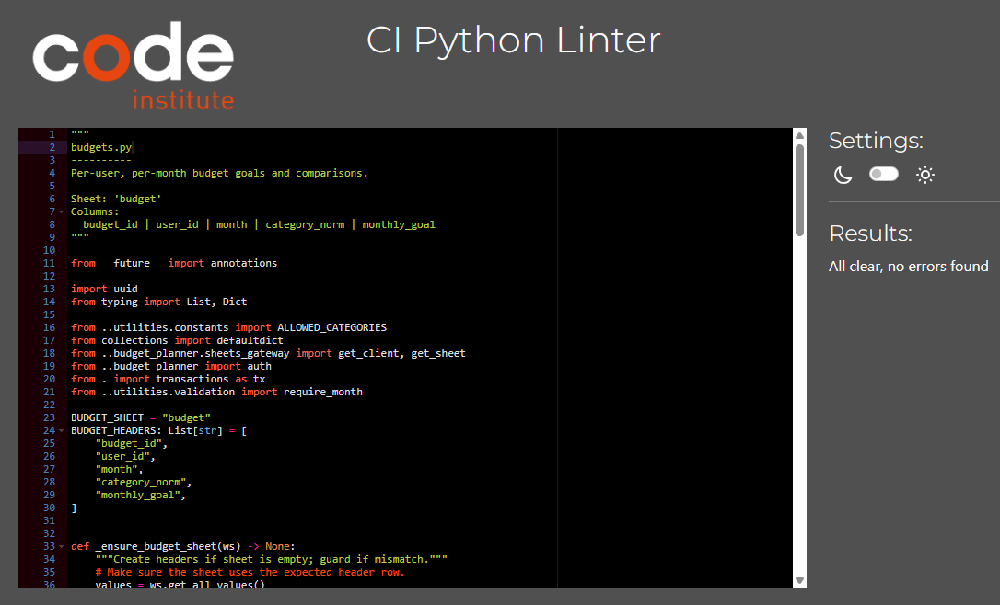

#### constants.py
Please see the CI Python Linter test passed for constants.py below with no errors found.
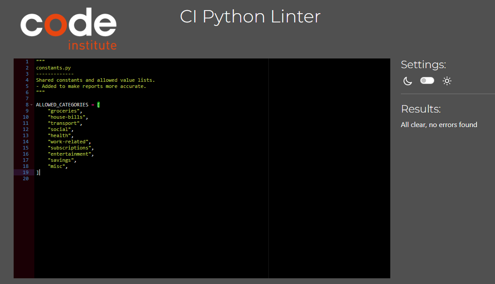

#### index.py
Please see the CI Python Linter test passed for index.py below with no errors found.

#### __main__.py
Please see the CI Python Linter test passed for __main__.py below with no errors found.
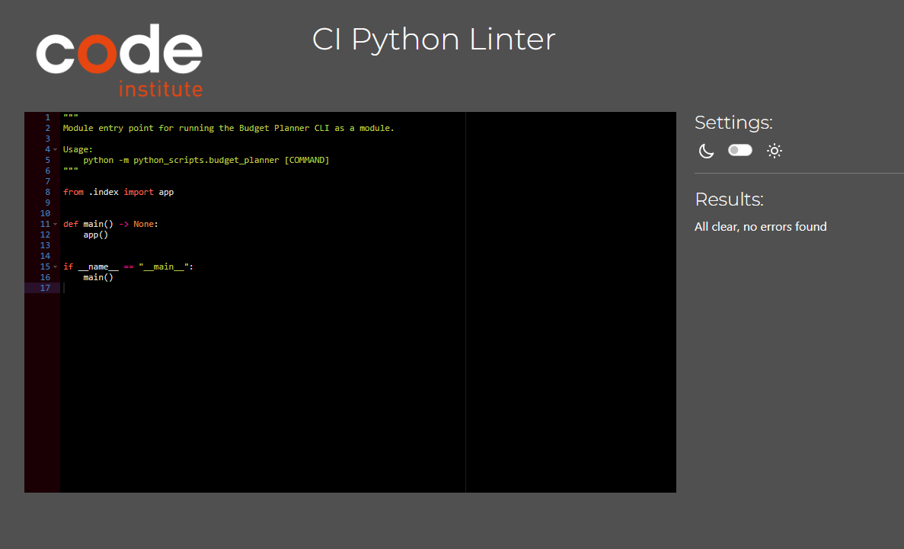

#### models.py
Please see the CI Python Linter test passed for models.py below with no errors found.
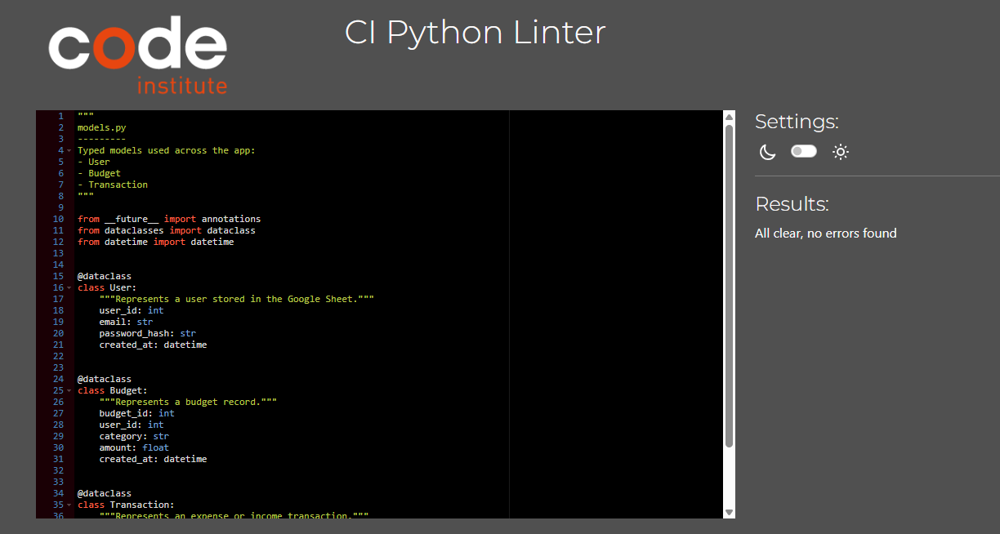

#### reports.py
Please see the CI Python Linter test passed for reports.py below with no errors found.
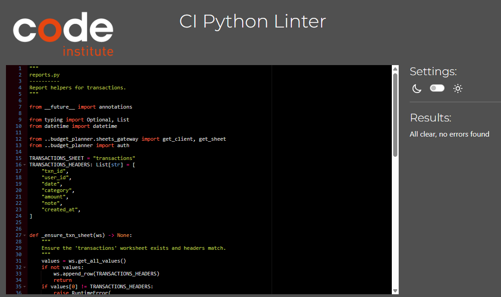

#### run.py
Please see the CI Python Linter test passed for run.py below with no errors found.
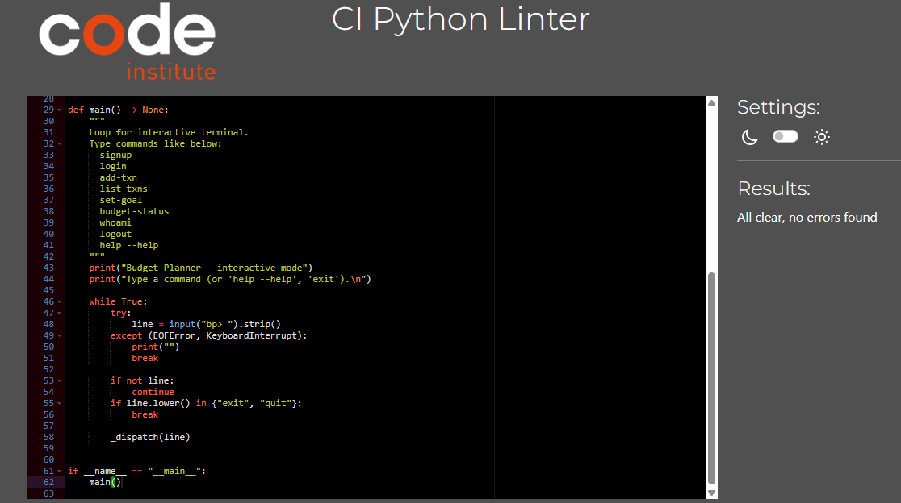

#### run_interactive.py
Please see the CI Python Linter test passed for run_interactive.py below with no errors found.
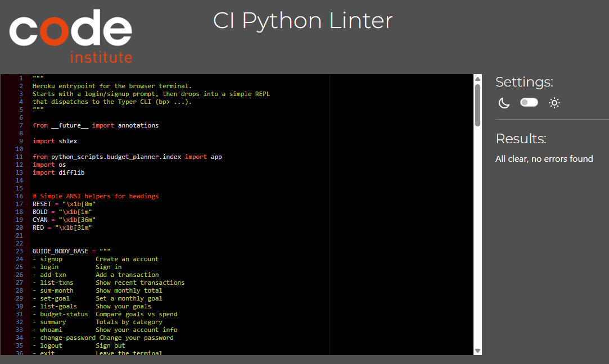

#### sheets_gateway.py
Please see the CI Python Linter test passed for sheets_gateway.py below with no errors found.
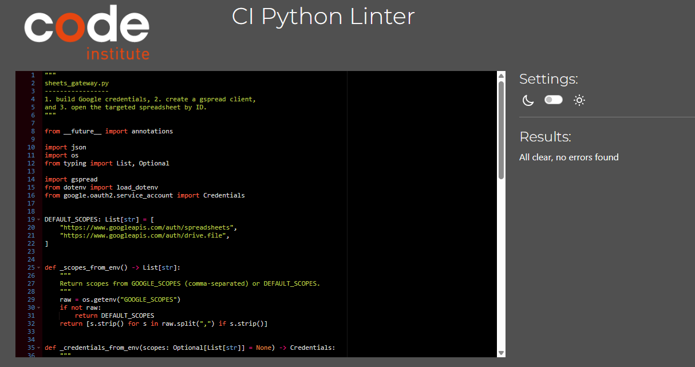

#### transactions.py
Please see the CI Python Linter test passed for transactions.py below with no errors found.

#### validation.py
Please see the CI Python Linter test passed for validation.py below with no errors found.
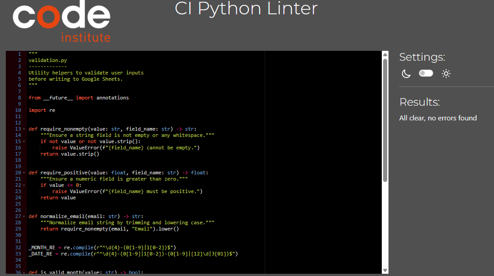

### Manual Testing
Manual testing was also carried out to ensure everything worked as expected. Each feature was tested to ensure the expeced outcome was pulling through. We also then tested our User Stories with the features to ensure users expectations were matched. 

#### Features 
In the below table all manual testing related to features was carried out. The results can be seen below.

| Feature | Expected outcome | Results |
|---|---|---|
| Signup | Creates a new user and shows a success message. | works as should |
| Login | Accepts correct email/password and logs the user in. | works as should |
| Change password | Asks for current password, updates to a new one if correct. | works as should |
| Logout | Clears the saved session so commands require login again. | works as should |
| Add transaction | Saves a row with date, category, amount and note. | works as should |
| List transactions | Shows recent transactions for the logged-in user. | works as should |
| Sum month | Shows the total spend for a given month. | works as should |
| Summary | Shows totals by category (for a date if given). | works as should |
| Set goal | Stores a monthly goal for a category and month. | works as should |
| List goals | Lists saved goals (optionally filter by month). | works as should |
| Budget status | Compares goals vs spend and colors the difference. | works as should |
| Whoami | Shows the current users id, email and created date. | works as should |
| Menu/Help | Prints the guide with commands and examples. | works as should |
| Exit | Leaves the terminal session cleanly. | works as should |
| Editor: list-users | Shows user list (editor only). | works as should |
| Editor: set-role | Changes a users role to user/editor (editor only). | works as should |
| Editor: per-user filters | Editor can use --email to act on another user when allowed. | works as should |

#### User Stories 
In the below table the results of the testing relating to user stories can be seen. Each user story has a feature that covers the desire of said user. As seen below all user stories were satisfied.

| User story | Feature | Action | Expected outcome | Results |
|---|---|---|---|---|
| I want to create an account so I can use the app. | signup | Enter a valid email and password twice. | Account is created and a success message is shown. | works as should |
| I want to sign in so the app knows who I am. | login | Enter the correct email and password. | Logged in/role shown and session is set for my commands. | works as should |
| I want to record money I spent. | add-txn | Provide date, category, amount and optional note. | A transaction row is saved and a success id is printed. | works as should |
| I want to view my recent spending. | list-txns | Run with optional date or limit filters. | A list of my recent transactions is displayed. | works as should |
| I want to set a budget for a category. | set-goal | Give month (YYYY-MM), category and amount. | Goal is saved and appears when listing goals. | works as should |
| I want to see how Im doing vs my goals. | budget-status | Run with optional month filter. | Table shows category, goal, spent and colored difference. | works as should |
| I want to update my password safely. | change-password | Enter current password, new password and confirm. | Password updates successfully and confirmation is shown. | works as should |
| I want a quick reminder of commands. | menu/help | Type menu or help (or --help). | Clear guide with commands and short explanations is shown. | works as should |

## Bugs 
The below are all bugs that were faced throughout the development of the budget planner application. As can be seen below, there were solutions for each bug and the issues were resolved.

| **Bug Title**                          | **Issue**                                                                                             | **Fix**                                                                                               |
| -------------------------------------- | ----------------------------------------------------------------------------------------------------- | ----------------------------------------------------------------------------------------------------- |
| CLI command not recognised             | Some commands such as `ist-txns` returned “No such command” errors.                                   | Spelling mistake fixed to `list-txns` and re-tested all command names.                                |
| Wrong month filtering in budget report | The `budget-status` command caused an error due to missing `month` handling.                          | Updated `budgets.py` to handle month filtering safely and normalised category matching.               |
| Missing environment variable           | The app crashed when trying to access Google Sheets API credentials.                                  | Added `.env` file and set environment variables on Heroku using `heroku config:set`. |
| Duplicate goal entries                 | Setting a budget goal multiple times created duplicates in the Google Sheet.                          | Added logic in `budgets.py` to check if a goal already exists before creating new rows.              |
| Colour formatting not displaying       | The red/green colour codes were not appearing correctly in the Heroku terminal.                       | Switched to using `typer.colors` for consistent colour output.                         |
| Terminal output overflow on mobile     | On smaller screens - text in the web terminal overflowed outside the view area.                        | Added CSS rules to make the terminal container scrollable and responsive.                             |

## Deployment
The below steps showcase how to deploy effectively. 

### Local Setup

To run this project locally:

1) Clone the repository (or use the Code Institute Python Essentials Template).

2) Create and activate a virtual environment (Python 3.12 recommended):

3) Install dependencies: (pip install -r requirements.txt)

4) Add `.venv` to your `.gitignore` so the virtual environment is not committed.

### Google Sheet Setup

- Create a Google Cloud project and enable the Google Sheets API and Google Drive API.
- Create a Service Account and download the JSON key.
- Save the key as `service_account.json` in the project root (ensure it is in `.gitignore`).
- In your Google Sheet, click Share and grant access to the `client_email` from your JSON.
- Create a Google Sheet with these tabs and headers:
  - `users` -- `user_id, email, password_hash, created_at`
  - `transactions` -- `txn_id, user_id, date, category, amount, note`
  - `budgets` -- `budget_id, user_id, month, category_norm, monthly_goal`
  - `role` -- `email, role`

### Environment Variables

Create a `.env` file in the project root and include:

  - `SHEET_ID`= your_google_sheet_id
  - `GOOGLE_CREDS_JSON`= your_entire_json_content_on_one_line
  - `PORT`= 8000

You can find your Google Sheet ID in the sheet URL between `/d/` and `/edit`.

### Running the App Locally

- Run the CLI directly: (python -m python_scripts.budget_planner.index)

- Or run the interactive web terminal (Node.js / node index.js)

Then open `http://localhost:8000/terminal.html` in your browser.

### Version Control

This project uses Git for version control.

### Heroku Deployment

To deploy on Heroku:

1) Ensure these files exist in the repo:
   - `requirements.txt` (Python dependencies)
   - `Procfile` (e.g., `web: node index.js`)
   - `.gitignore` (excludes `.venv` and `service_account.json`)

2) In Heroku, click New → Create New App, choose a unique name and region.

3) Config Vars (Settings → Reveal Config Vars):

| Key | Value |
| --- | --- |
| `SHEET_ID` | your_google_sheet_id |
| `GOOGLE_CREDS_JSON` | paste entire JSON content (one line) |
| `PORT` | `8000` |

4) Buildpacks (in this order):
   - Python
   - Node.js

5) Connect to GitHub (Deploy tab) and link your repository.
   - Optionally enable Automatic Deploys.

6) Manual Deploy (if needed): click Deploy Branch.

7) Open App when deploy completes.

Your app will be live at: https://your-app-name.herokuapp.com/terminal.html

## Credits

- [Code Institute](https://codeinstitute.net/) - Learning material.
- [Typer Docs](https://typer.tiangolo.com/) - CLI framework reference.
- [gspread Docs](https://docs.gspread.org/) - Google Sheets client library.
- [Google Sheets API](https://developers.google.com/sheets/api) - API and authentication setup.
- [Heroku Dev Center](https://devcenter.heroku.com/) - Buildpacks and deployment help.
- [node-pty](https://github.com/microsoft/node-pty) - PTY bridge used by the web terminal.
- [Fluent Python](https://books.google.ie/books/about/Fluent_Python.html?id=bIZHCgAAQBAJ&source=kp_cover&redir_esc=y) - (Book) Learning materials and coding tips.
- [W3Schools](https://www.w3schools.com/) - General troubleshooting and quick references.
- [P3_expense_tracker](https://github.com/Code-Institute-Submissions/p3_expense_tracker) - Deployment section of README file was used as a guide.

### Content Credits

- [am i responsive](https://ui.dev/amiresponsive) - Responsive tool used to showcase the budget planner on different devices.
- [Markdown Guide](https://www.markdownguide.org/) - Help with table and formatting.

### Acknowledgements

- All Code Institute Lecturers and Staff - for the continued support during this project

